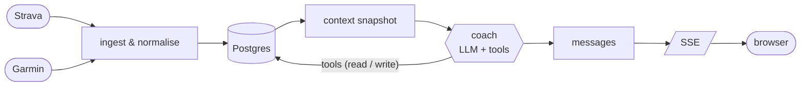
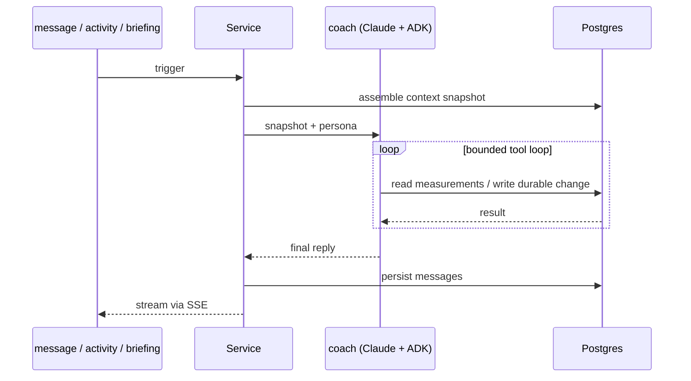

# Architecture

Activity and wellness data is normalised into Postgres on the way in. A Go metric
engine computes every measurement (load, pace, zones, drift, weekly aggregates);
the coach is handed those numbers and never re-derives them. The line between what
is *measured* (computed, handed over) and what is *judged* (the coach's call) is
the governing constraint — see [`brief.md`](brief.md) Amendment A.

## The coach

The agent runs on Google ADK; `go/coach/claude.go` bridges the Anthropic SDK to
ADK's `model.LLM` so Claude (`CLAUDE_MODEL`, default `claude-opus-4-8`) drives it,
with prompt caching on the system prompt and last user message. The persona lives
in `go/coach/coach.go`.

A turn is triggered by a chat message, a newly-synced activity, or the daily
briefing, and runs a bounded tool loop before anything reaches the athlete:

It acts only through tools:

| Group | Tools | Notes |
|---|---|---|
| Metrics (`tools.go`) | `training_status`, `weekly_training`, `recent_activities` | Read-only; all numbers from the metric engine. |
| Memory (`memory.go`) | `record_fact`, `recall_facts`, `resolve_fact` | Durable runner knowledge in `runner_facts`. |
| Plan (`plan.go`) | `current_plan`, `set_goal`, `generate_plan_block`, `update_plan_day`, `set_projection` | `update_plan_day` writes a **proposal** the athlete approves in the UI; the rest apply directly. |

## Data & integrations

- The [goose](https://github.com/pressly/goose) migrations in `db/migrations` are
  the schema's source of truth; [sqlc](https://sqlc.dev) generates the query layer
  from `db/queries` (see [`schema.md`](schema.md)).
- **Strava** — a webhook acknowledges fast and ingests in the background; a
  history backfill runs on connect. Only distance-bearing activities are stored.
- **Garmin** — optional wellness enrichment (HRV, resting HR, sleep) behind an
  interface, treated as best-effort; when it breaks the coach runs on Strava alone.
