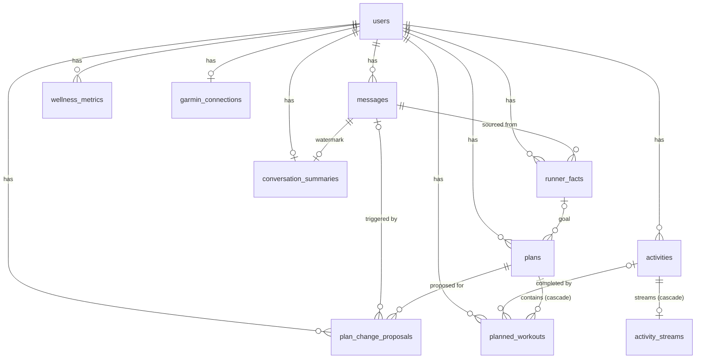

# Database Schema

The canonical table reference is [`db/schema.sql`](../db/schema.sql), regenerated from the goose migrations by `tools/schemadump` (it replays `db/migrations` into a throwaway Postgres and dumps the result).
sqlc (`db/sqlc.yaml`) generates the Go layer in `go/database` from the migrations.

## Overview

The relationships below are the foreign keys declared in the migration; the
tables-only `schema.sql` does not carry them.

